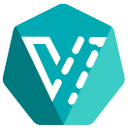
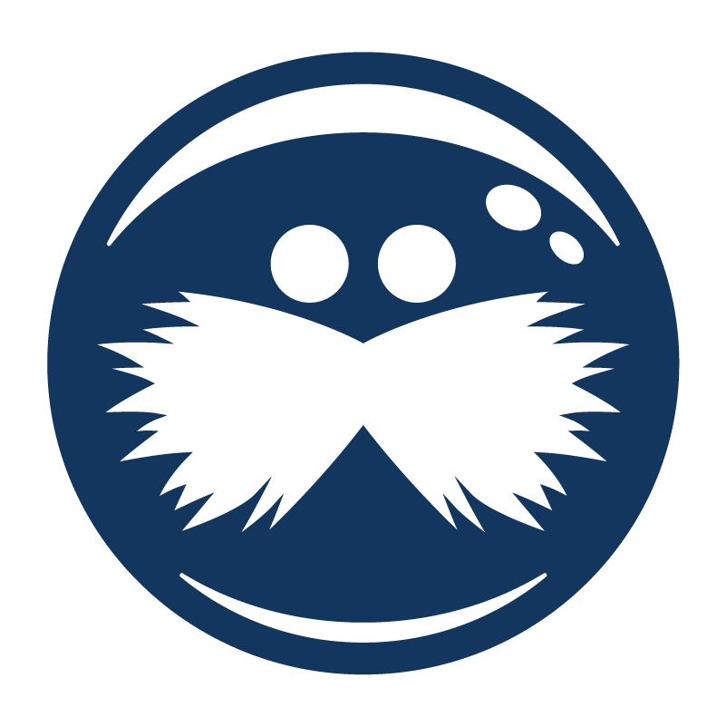
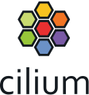
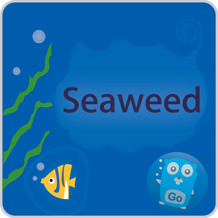

  
  

  
  
  
  
  
  

  <a href="https://cozystack.io/"><strong>Cozystack</strong></a> is a free PaaS platform and framework for building clouds.

# Main features

With Cozystack, you can transform your bunch of servers into an intelligent system with a simple REST API for spawning Kubernetes clusters, Database-as-a-Service, virtual machines, load balancers, HTTP caching services, and other services with ease.

You can use Cozystack to build your own cloud or to provide a cost-effective development environments.

 Enhance your Infrastructure with Cozystack!

## Use-Cases

* [**Using Cozystack to build public cloud**](https://cozystack.io/docs/use-cases/public-cloud/)  
You can use Cozystack as backend for a public cloud

* [**Using Cozystack to build private cloud**](https://cozystack.io/docs/use-cases/private-cloud/)  
You can use Cozystack as platform to build a private cloud powered by Infrastructure-as-Code approach

* [**Using Cozystack as Kubernetes distribution**](https://cozystack.io/docs/use-cases/kubernetes-distribution/)  
You can use Cozystack as Kubernetes distribution for Bare Metal

## Screenshot

## Documentation

The documentation is located on official [cozystack.io](https://cozystack.io) website.

🚀 Read [Get Started](https://cozystack.io/docs/get-started/) section for a quick start. 

If you encounter any difficulties, start with the [troubleshooting guide](https://cozystack.io/docs/troubleshooting/), and work your way through the process that we've outlined.

## Basic Platform Stack

<!-- 

  

 -->

<table class="table table-white table-borderer border-dark w-auto align-middle">
    <tr>
        <th></th>
        <th>Name</th>
        <th>Description</th>
    </tr>
    <tr>
        <td></td>
        <td><a href="https://www.ansible.com">Kubernetes</a></td>
        <td>Kubernetes has already become a kind of de facto standard for managing server workloads.</td>
    </tr>
    <tr>
        <td></td>
        <td><a href="https://argoproj.github.io/cd">Flux CD</a></td>
        <td>We use FluxCD as the core element of our platform, believing it sets a new industry standard for platform engineering.</td>
    </tr>
    <tr>
        <td></td>
        <td><a href="https://cloudinit.readthedocs.io/en/latest/">Talos Linux</a></td>
        <td>Using Talos Linux as the base layer for the platform allows to strictly limit the technology stack and make the system stable as a rock.</td>
    </tr>
    <tr>
        <td></td>
        <td><a href="https://ubuntu.com/">KubeVirt</a></td>
        <td>KubeVirt extends the capabilities of Kubernetes by providing convenient abstractions for launching and managing virtual machines, as well the all related entities such as snapshots, presets, virtual volumes, and more.</td>
    </tr>
    <tr>
        <td></td>
        <td><a href="https://k3s.io/">Kamaji</a></td>
        <td>We use Kamaji to deploy user Kubernetes clusters. Kamaji provides a straightforward and convenient method for launching all the necessary Kubernetes control-plane in containers</td>
    </tr>
    <tr>
        <td></td>
        <td><a href="https://containerd.io/">DRBD</a></td>
        <td>DRBD is the fastest replication block storage running right in the Linux kernel. When DRBD only deals with data replication, time-tested technologies such as LVM or ZFS are used for securely store the data.</td>
    </tr>
    <tr>
        <td></td>
        <td><a href="https://cilium.io">OVN</a></td>
        <td>OVN is a free implementation of virtual network fabric for Kubernetes and OpenStack based on Open vSwitch technology.</td>
    </tr>
    <tr>
        <td></td>
        <td><a href="https://coredns.io/">Cilium</a></td>
        <td>Utilizing Cilium in conjunction with OVN enables the most efficient and flexible network policies, along with a productive services network in Kubernetes, leveraging an offloaded Linux network stack featuring the cutting-edge eBPF technology.</td>
    </tr>
    <tr>
        <td></td>
        <td><a href="https://www.haproxy.org/">Grafana</a></td>
        <td>Grafana with Grafana Loki and the OnCall extension provides a single interface to Observability.</td>
    </tr>
    <tr>
        <td></td>
        <td><a href="https://metallb.universe.tf/">Victoria Metrics</a></td>
        <td>Victoria Metrics allows you to most efficiently collect, store and process metrics in the Open Metrics format, doing it more efficiently than Prometheus in the same setup.</td>
    </tr>
    <tr>
        <td></td>
        <td><a href="https://kubernetes.github.io/ingress-nginx/">MetalLB</a></td>
        <td>MetalLB is the default load balancer for Kubernetes; with its help, your services can obtain public addresses that are accessible not only from inside, but also from outside your cluster network.</td>
    </tr> 
    <tr>
        <td></td>
        <td><a href="https://istio.io/">Haproxy</a></td>
        <td>HAProxy is an advanced and widely known TCP balancer. It continuously checks the availability of services and carefully balance production traffic between them in real time.</td>
    </tr>
    <tr>
        <td></td>
        <td><a href="https://min.io/">SeaweedFS</a></td>
        <td>SeaweedFS is a simple and highly scalable distributed file system designed for two main objectives: to store billions of files and to serve the files faster. It allows access O(1), usually just one disk read operation.</td>
    </tr>
    <tr>
        <td></td>
        <td><a href="https://cert-manager.io">Cert-manager</a></td>
        <td>TLS Certificates management</td>
    </tr>
    <tr>
        <td></td>
        <td><a href="https://external-secrets.io/">External Secrets Operator</a></td>
        <td>External Secrets Operator is a Kubernetes operator that integrates external secret management systems like AWS Secrets Manager, HashiCorp Vault, Google Secrets Manager, Azure Key Vault, IBM Cloud Secrets Manager, Akeyless, CyberArk Conjur, Pulumi ESC and many more.</td>
    </tr>
</table>

## Application stack

<table class="table table-white table-borderer border-dark w-auto align-middle">
    <tr>
        <th></th>
        <th>Name</th>
        <th>Description</th>
    </tr>
    <tr>
        <td></td>
        <td><a href="https://aa/">Managed PostgreSQL</a></td>
        <td>Nowadays PostgreSQL is the most popular relational database. Its platform-side implementation involves a self-healing replicated cluster, managed with the increasingly popular CloudNativePG operator within the community.</td>
    </tr>
    <tr>
        <td></td>
        <td><a href="https://aa/">Managed MySQL</a></td>
        <td>MySQL is an equally well-known and also widely used relational database. The implementation in the platform provides the ability to create a replicated MariaDB cluster, which is managed using the increasingly popular mariadb-operator.</td>
    </tr>
    <tr>
        <td></td>
        <td><a href="https://aa/">Managed Redis</a></td>
        <td>Redis is the most commonly used key-value in-memory data store. It is most often used as a cache, as storage for user sessions, or as a message broker.</td>
    </tr>
    <tr>
        <td></td>
        <td><a href="https://aa/">Managed FerretDB</a></td>
        <td>FerretDB is an open source MongoDB alternative, that translates MongoDB wire protocol queries to SQL and can be used as a direct replacement for MongoDB 5.0+.</td>
    </tr>
    <tr>
        <td></td>
        <td><a href="https://aa/">Managed Clickhouse</a></td>
        <td>ClickHouse is an open source high-performance and column-oriented SQL database management system (DBMS).</td>
    </tr>
    <tr>
        <td></td>
        <td><a href="https://aa/">Managed RabbitMQ</a></td>
        <td>Widely known message broker. Platform-side implementation allows you to create failover clusters managed by the official RabbitMQ operator.</td>
    </tr>
    <tr>
        <td></td>
        <td><a href="https://aa/">Managed Kafka</a></td>
        <td>Apache Kafka is an open-source distributed event streaming platform that aims to provide a unified, high-throughput, low-latency platform for handling real-time data feeds.</td>
    </tr>
    <tr>
        <td></td>
        <td><a href="https://aa/">Managed HTTP Cache</a></td>
        <td>Nginx-based HTTP caching service - with its help you can always protect your application from overload using the powerful Nginx, which is traditionally used to build CDNs and caching servers.</td>
    </tr>
    <tr>
        <td></td>
        <td><a href="https://aa/">Managed NATS Messaging</a></td>
        <td>NATS is an open-source, simple, secure and high performance messaging system. It provides data layer for cloud native applications, IoT messaging, and microservices architectures.</td>
    </tr>
    <tr>
        <td></td>
        <td><a href="https://aa/">Managed Kubernetes</a></td>
        <td>Managed Kubernetes is a service that allows you to create full-featured Kubernetes clusters on demand, right out of the box, with just the click of a button. For each cluster, a separate managed control-plane and virtual compute nodes are created.</td>
    </tr>
    <tr>
        <td></td>
        <td><a href="https://aa/">Managed VPN Service</a></td>
        <td>The VPN Service is powered by the Outline Server, an advanced and user-friendly VPN solution. Internally known as “Shadowbox”, which simplifies the process of setting up and sharing Shadowsocks servers.</td>
    </tr>
</table>

## Versioning

Versioning adheres to the [Semantic Versioning](http://semver.org/) principles.  
A full list of the available releases is available in the GitHub repository's [Release](https://github.com/aenix-io/cozystack/releases) section.

- [Roadmap](https://github.com/orgs/aenix-io/projects/2)

## Contributions

Contributions are highly appreciated and very welcomed!

In case of bugs, please, check if the issue has been already opened by checking the [GitHub Issues](https://github.com/aenix-io/cozystack/issues) section.
In case it isn't, you can open a new one: a detailed report will help us to replicate it, assess it, and work on a fix.

You can express your intention in working on the fix on your own.
Commits are used to generate the changelog, and their author will be referenced in it.

In case of **Feature Requests** please use the [Discussion's Feature Request section](https://github.com/aenix-io/cozystack/discussions/categories/feature-requests).

You can join our weekly community meetings (just add this events to your [Google Calendar](https://calendar.google.com/calendar?cid=ZTQzZDIxZTVjOWI0NWE5NWYyOGM1ZDY0OWMyY2IxZTFmNDMzZTJlNjUzYjU2ZGJiZGE3NGNhMzA2ZjBkMGY2OEBncm91cC5jYWxlbmRhci5nb29nbGUuY29t) or [iCal](https://calendar.google.com/calendar/ical/e43d21e5c9b45a95f28c5d649c2cb1e1f433e2e653b56dbbda74ca306f0d0f68%40group.calendar.google.com/public/basic.ics)) or [Telegram group](https://t.me/cozystack).

## License

Cozystack is licensed under Apache 2.0.  
The code is provided as-is with no warranties.

## Commercial Support

[**Ænix**](https://aenix.io) offers enterprise-grade support, available 24/7.

We provide all types of assistance, including consultations, development of missing features, design, assistance with installation, and integration.

[Contact us](https://aenix.io/contact/)
